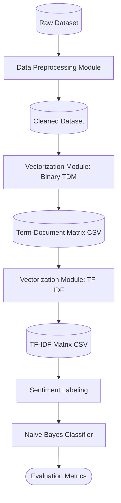

# System Architecture

This document outlines the technical design, data flow, and modular architecture of the NLP pipeline developed for this repository. The system is designed to run locally, ensuring all data processing and model training happens within this controlled environment.

## 🏗️ High-Level Architecture

The system is designed as a sequential, feed-forward data pipeline. Raw text data is ingested, normalized, transformed into mathematical representations, and finally fed into a probabilistic machine learning model.

## 🧩 Core Modules

### 1. Data Preprocessing (`src/preprocessing.py`)

Responsible for standardizing the input text.

* **Inputs:** Raw text strings from the opinions dataset.
* **Processes:** Lowercasing, Regex-based punctuation removal, NLTK/Spacy-based Tokenization, Stopword filtering, Stemming (e.g., PorterStemmer), and Lemmatization.
* **Outputs:** Cleaned text data, ready for numerical representation.

### 2. Exploratory Data Analysis & Visualization (`src/visualization.py`)

Handles the generation of insights and visual evidence required for reporting.

* **Processes:** Frequency distribution calculations, Matplotlib statistical plotting, WordCloud generation.
* **Outputs:** Saved image files (PNG/JPG) located in the `reports/` directory.

### 3. Custom Vectorization (`src/vectorization.py`)

*The core engineering challenge of the project.* Built strictly with `pandas` and `numpy` to handle matrix operations efficiently, explicitly avoiding standard ML library shortcuts for feature extraction.

* **Binary TDM:** Scans the global vocabulary and maps each document to a binary vector space `V` where `V_i ∈ {0, 1}`. Output is saved as a CSV.
* **TF-IDF:** Calculates the term frequency $TF(t, d)$ and multiplies it by the inverse document frequency $IDF(t, D)$, broadcasting operations over `numpy` arrays for performance optimization. Output is saved as a CSV.

### 4. Classification & Evaluation (`src/main.py` or dedicated script)

Integrates the engineered features with the predictive model.

* **Model:** Multinomial Naive Bayes (using a provided or custom script).
* **Inputs:** The labeled dataset and the custom TF-IDF matrix.
* **Evaluation:** Accuracy, Precision, Recall, and F1-Score metrics are extracted to evaluate the classifier's performance on the Positive, Negative, and Neutral classes.
